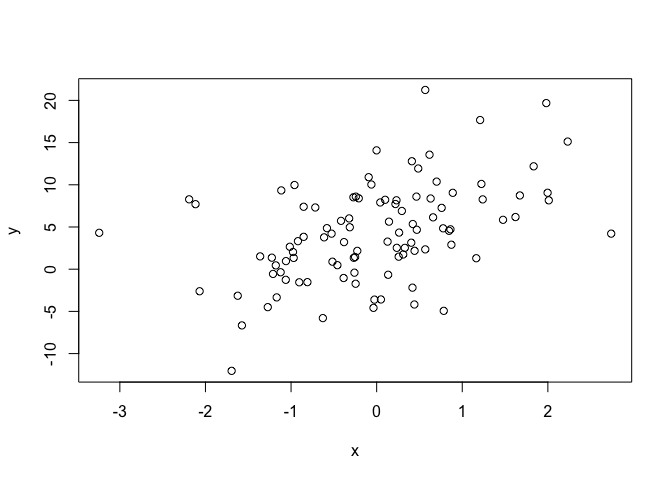
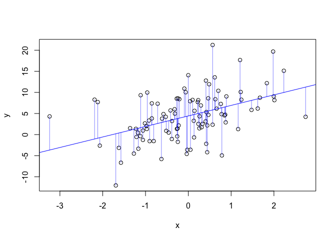
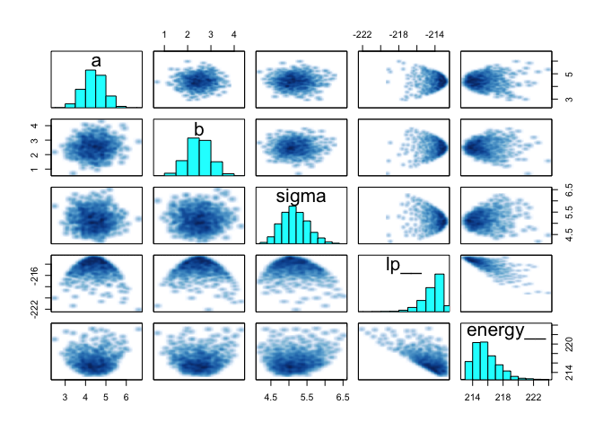
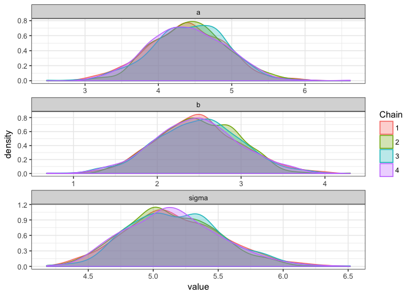
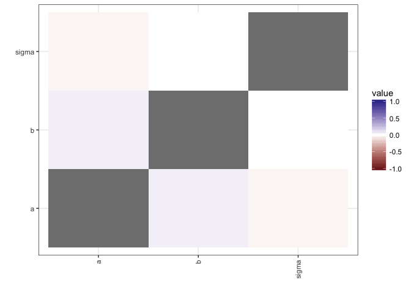
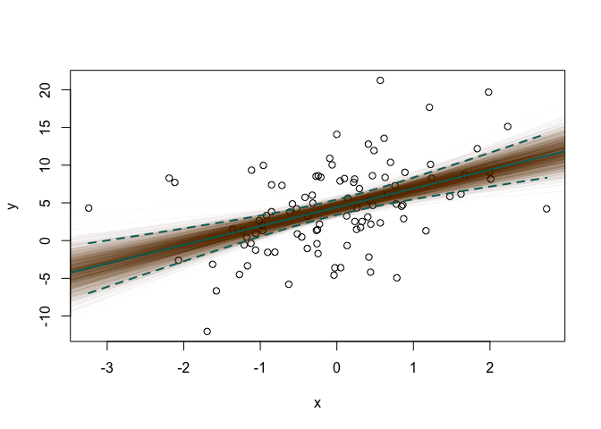
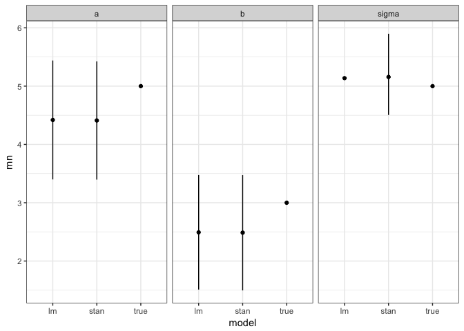

Intro to stan
================
Tim Szewczyk
Wed Sep 27 18:45:01 2017

``` r
## Introduction to stan for Allen lab meeting on 2017 Oct 19. This script
## provides a basic comparison of a simple linear regression using standard
## frequentist methods in R vs. a Bayesian implementation in stan. While this
## example is much easier to do using base R, the advantages of stan (and
## Bayesian methods) become clear with more complex model structures.
```

``` r
## set up environment
```

``` r
if(!require(pacman)) install.packages("pacman")
```

    ## Loading required package: pacman

``` r
p_load(tidyverse, rstan, ggmcmc, here); theme_set(theme_bw())
rstan_options(auto_write=TRUE); options(mc.cores=parallel::detectCores())
```

``` r
## data simulation
```

``` r
n <- 200
a <- 5
b <- 3
sigma <- 3
sim.df <- data.frame(x=rnorm(n, 0, 1))
sim.df$y <- rnorm(n, a + b*sim.df$x, sigma)
plot(y ~ x, data=sim.df)
```



``` r
## linear regression with lm()
```

``` r
out_lm <- lm(y ~ x, data=sim.df)
summary(out_lm)
```

    ## 
    ## Call:
    ## lm(formula = y ~ x, data = sim.df)
    ## 
    ## Residuals:
    ##     Min      1Q  Median      3Q     Max 
    ## -7.7520 -2.0044  0.1478  2.0878  7.3943 
    ## 
    ## Coefficients:
    ##             Estimate Std. Error t value Pr(>|t|)    
    ## (Intercept)   5.4559     0.2080   26.23   <2e-16 ***
    ## x             3.0626     0.2216   13.82   <2e-16 ***
    ## ---
    ## Signif. codes:  0 '***' 0.001 '**' 0.01 '*' 0.05 '.' 0.1 ' ' 1
    ## 
    ## Residual standard error: 2.934 on 198 degrees of freedom
    ## Multiple R-squared:  0.4909, Adjusted R-squared:  0.4884 
    ## F-statistic:   191 on 1 and 198 DF,  p-value: < 2.2e-16

``` r
par(mfrow=c(2,2))
plot(out_lm)
```


``` r
new.x <- data.frame(x=seq(min(sim.df$x), max(sim.df$x), length.out=100))
pred.lm <- predict(out_lm, new.x, interval="confidence")
par(mfrow=c(1,1))
plot(y ~ x, data=sim.df)
abline(out_lm, col="blue")
lines(new.x$x, pred.lm[,2], col="blue", lty=2)
lines(new.x$x, pred.lm[,3], col="blue", lty=2)
```



``` r
## linear regression with stan
```

``` r
stan_d <- list(n=n, x=sim.df$x, y=sim.df$y)
out_stan <- stan(file=here("code", "lm.stan"), data=stan_d, iter=10000)
out_stan
```

    ## Inference for Stan model: lm.
    ## 4 chains, each with iter=10000; warmup=5000; thin=1; 
    ## post-warmup draws per chain=5000, total post-warmup draws=20000.
    ## 
    ##          mean se_mean   sd    2.5%     25%     50%     75%   97.5% n_eff
    ## a        5.45    0.00 0.21    5.04    5.31    5.45    5.59    5.87 17553
    ## b        3.06    0.00 0.22    2.62    2.91    3.06    3.21    3.49 18614
    ## sigma    2.94    0.00 0.15    2.67    2.84    2.94    3.04    3.25 17972
    ## lp__  -315.74    0.01 1.23 -318.91 -316.30 -315.42 -314.84 -314.33  9877
    ##       Rhat
    ## a        1
    ## b        1
    ## sigma    1
    ## lp__     1
    ## 
    ## Samples were drawn using NUTS(diag_e) at Wed Sep 27 18:45:17 2017.
    ## For each parameter, n_eff is a crude measure of effective sample size,
    ## and Rhat is the potential scale reduction factor on split chains (at 
    ## convergence, Rhat=1).

``` r
plot(out_stan)
```

    ## ci_level: 0.8 (80% intervals)

    ## outer_level: 0.95 (95% intervals)


``` r
traceplot(out_stan)
```


``` r
pairs(out_stan)
```



``` r
stan_diag(out_stan)
```

    ## Warning: Removed 1 rows containing missing values (geom_bar).


``` r
stan_rhat(out_stan)
```

    ## `stat_bin()` using `bins = 30`. Pick better value with `binwidth`.



``` r
stan.gg <- ggs(out_stan)
ggs_density(stan.gg)
```



``` r
ggs_crosscorrelation(stan.gg)
```


``` r
ggs_autocorrelation(stan.gg)
```


``` r
## comparisons
```

``` r
nGG <- attr(stan.gg, "nChains")*attr(stan.gg, "nIterations")
stan.gg$iter <- rep(1:nGG, times=n_distinct(stan.gg$Parameter))
plot(y ~ x, data=sim.df)
for(i in 1:nGG) {
  abline(a=stan.gg$value[stan.gg$Parameter=="a" & stan.gg$iter==i],
         b=stan.gg$value[stan.gg$Parameter=="b" & stan.gg$iter==i],
         col=rgb(0,0,1,1/sqrt(nGG)))
}
abline(out_lm)
lines(new.x$x, pred.lm[,2], lty=2)
lines(new.x$x, pred.lm[,3], lty=2)
```



``` r
comp.df <- stan.gg %>% group_by(Parameter) %>%
  summarise(mn=mean(value), 
            loCI=quantile(value, 0.025),
            hiCI=quantile(value, 0.975)) %>%
  mutate(model="stan")
comp.df <- comp.df %>% 
  add_row(Parameter=c("a", "b", "sigma"),
          mn=c(coef(out_lm), summary(out_lm)$sigma),
          loCI=c(confint(out_lm)[,1], NA),
          hiCI=c(confint(out_lm)[,2], NA),
          model="lm") %>%
  add_row(Parameter=c("a", "b", "sigma"),
          mn=c(a, b, sigma),
          loCI=NA, hiCI=NA, model="true")


ggplot(comp.df, aes(x=model, y=mn, ymin=loCI, ymax=hiCI)) + 
  geom_linerange() + geom_point() + facet_wrap(~Parameter)
```

    ## Warning: Removed 4 rows containing missing values (geom_linerange).


